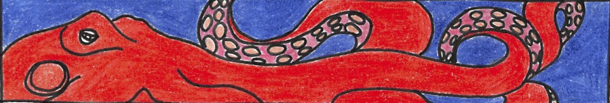

# OctoHand

OctoHand is a cephalopod-inspired Gymnasium environment for reinforcement learning and soft-robotics research. The robot is a simulated hand with tentacles: a palm that can translate and yaw, and underactuated fingers that curl the way a pneumatic silicone gripper does.

The beta ships three tasks, in the spirit of OpenAI's HandManipulate benchmarks:

| Environment | Object | Goal |
| --- | --- | --- |
| `OctoHandBlock-v0` | cube | move it to a target position |
| `OctoHandEgg-v0` | ellipsoid | move it to a target position; the shell is slipperier |
| `OctoHandPen-v0` | capsule | move it, and line its long axis up with a target heading |

Each tentacle is one curl command, shared across its joints, standing in for a single pressure line on Festo's [OctopusGripper](https://www.festo.com/group/en/cms/12745.htm). The default hand has three tentacles. Two to eight are supported.

## Install

```bash
python3.12 -m venv .venv
source .venv/bin/activate
pip install -e ".[dev]"
```

## Try a grasp

A scripted motion sequence — move above the object, descend, curl, lift, carry — is the baseline controller. It is not a learned policy.

```bash
python -m octohand.demo --task block --seed 1 --verbose
python -m octohand.demo --task egg --seed 0
python -m octohand.demo --task pen --seed 0
```

`--frames out/` writes PNG frames of the episode. On the block and the egg this sequence usually places the object. The pen is harder: the hand has to yaw so a tentacle is not aimed down the shaft, then turn the pen to match the goal.

```python
import gymnasium as gym
import octohand  # registers the environments

env = gym.make("OctoHandBlock-v0")
obs, info = env.reset(seed=1)
obs, reward, terminated, truncated, info = env.step(env.action_space.sample())
env.close()
```

`info["success"]` is true once the object has stayed inside the goal tolerance (5 cm, and for the pen a long-axis alignment of 0.8) for 12 control steps.

## Train

Two learners from the original stub now train on OctoHand instead of CartPole.

Particle swarm search fits a linear policy `tanh(Wo + b)`. This is the optimizer that `agent/pso.py` was reaching for:

```bash
python -m octohand.train pso --task block --particles 8 --iters 10 --out data/pso_block.npy
```

The DQN is the original two-layer network (24 and 24 units, replay, Adam, γ = 0.95), with a target network added, driving a discrete wrapper that nudges the same continuous command:

```bash
python -m octohand.train dqn --task block --episodes 30
```

Episode returns are appended to `data/scores.db` (`date`, `scores`, `time`). Neither learner is expected to solve the pen from a short run. The swarm is the more natural fit, because the hand is continuous.

## Action and observation

Actions are in `[-1, 1]`.

| Index | Joint | −1 | +1 |
| --- | --- | --- | --- |
| 0–1 | palm x, y | −0.16 m | +0.16 m |
| 2 | palm z | down | up |
| 3 | yaw | −180° | +180° |
| 4… | tentacle curl | open | closed |

Zero on the palm axes holds the home pose, centered and clear of the table. Curl is open at −1 and closed at +1.

The observation is a flat vector: palm pose and velocity, yaw, per-tentacle curl, fingertip positions relative to the object, object pose and velocity, the vector from the object to the goal, the goal axis, and how many tentacles are touching the object. `env.observation_labels()` names each entry. Positions are scaled by 0.3 m so the values sit near 1.

Reward is mostly progress toward the goal, plus small bonuses for a multi-tentacle grasp and for lifting, and a penalty if the object leaves the table.

## Layout

```
octohand/model.py      MuJoCo description of the hand
octohand/env.py        Gymnasium tasks
octohand/scripted.py   grasp-and-place baseline
octohand/agents/       linear policy, particle swarm, DQN
octohand/wrappers.py   discrete nudges for the DQN
```

```bash
pytest
```

## Inspiration

OctoHand simulates the basic physics of a Festo tentacle and a small motion terminal that positions the hand and sequences its curl. The aim is a set of manipulation environments where the task is to grip an object and move it to a pose, and to do that with a body that is not a copy of the human hand.

The gripper geometry follows the physical constraints of that industrial gripper, documented with Festo's research partners at Beihang University. The beta starts at three tentacles because that is the machine; the model will build more if you ask it to.

Drawing on nature in robotics is not new. Using a non-human body as a shared, open benchmark for reinforcement learning is less common. Other researchers can test algorithms on a morphology they did not grow up with. More broadly, OctoHand is a prompt to think about embodied intelligence past an anthropic default.

Physics is MuJoCo, and the task API is Gymnasium, the maintained successor of OpenAI Gym. A move to ROS is still an open question; collaboration with people in both the Open Robotics and OpenAI communities is welcome.

In MIRI's Alignment for Advanced Machine Learning Systems, one research topic was robust human imitation: how do we design and train ML systems to imitate humans doing complex, difficult tasks? On some physical tasks humans are not the specialists (fastest land speed is the cheetah; matching color and texture belongs to the octopus). Robotics keeps being handed new physical problems, and soft, nature-inspired bodies are one place those problems get easier to state.
